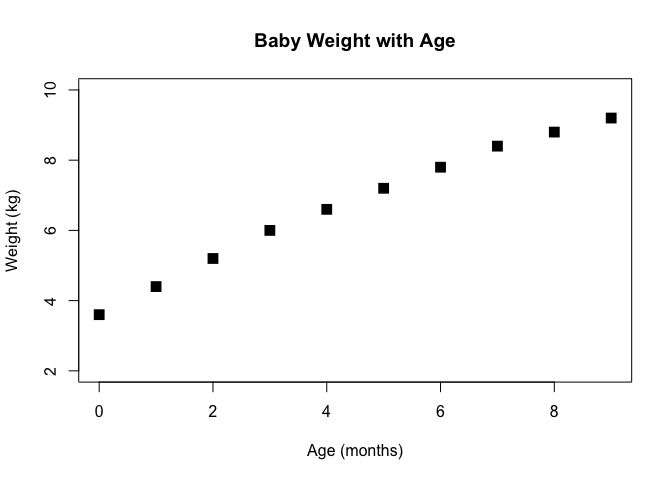
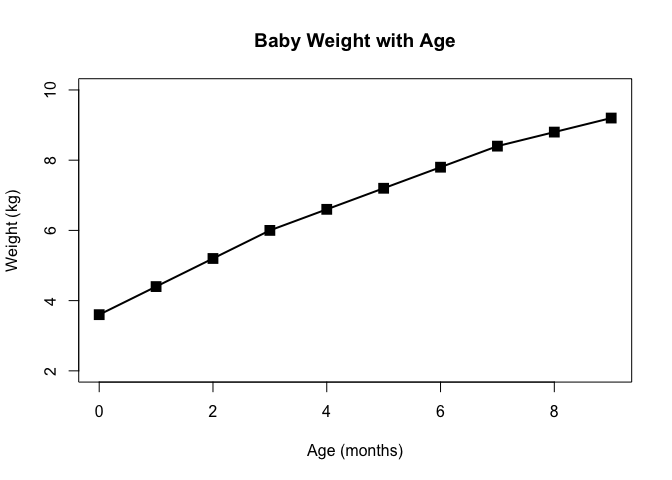
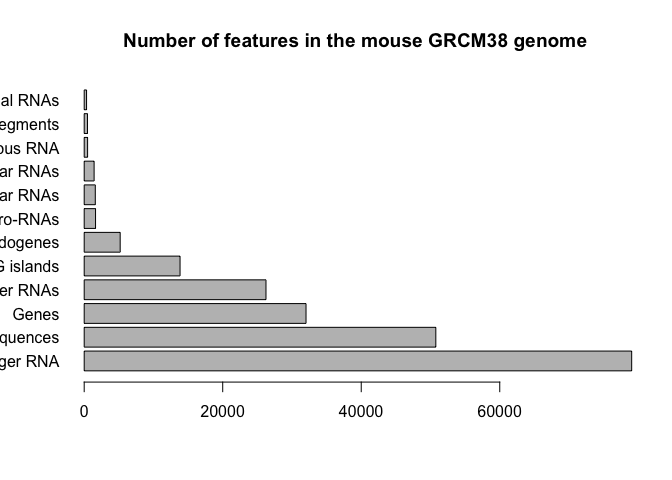
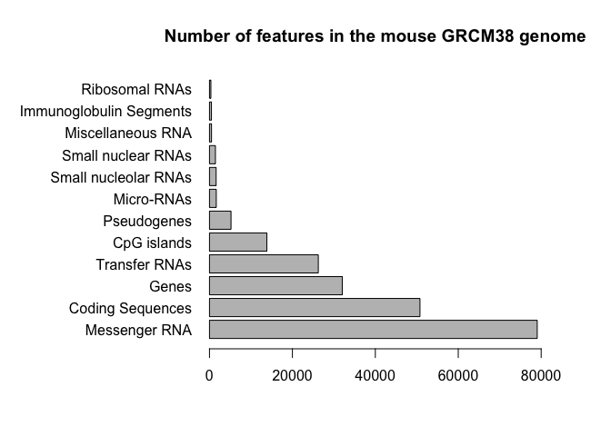
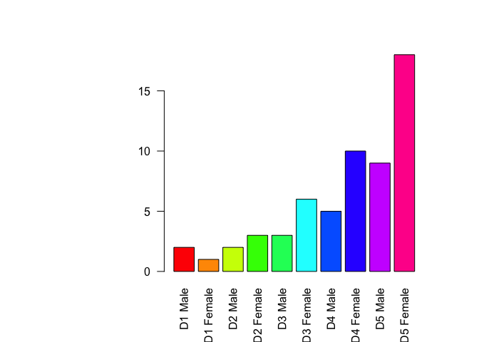
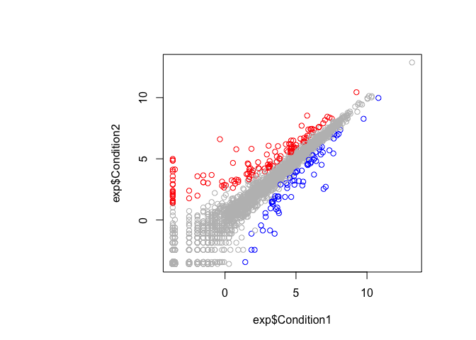

Class 05 Report: Graphics and Plots with R
================
Katelynn Kazane
January 25th, 2019

Class 05 graphics and plots with R This is how we can add style to **bold** and *italics* we can also add webpages and all sorts of stuff. Links can be put in with [webpages](https://rmarkdown.rstudio.com/articles_report_from_r_script.html) Can save all this as word/pdf/etc. can also change the automatic output by adjusting this header.

``` r
# Section 2A: line plots

weight <- read.table("bimm143_05_rstats/weight_chart.txt", header = TRUE)

#using the following to help change the drawing of a line plot
plot(weight$Age, weight$Weight, pch=15, cex=1.5, lwd=2, ylim=c(2,10), xlab="Age (months)",
     ylab="Weight (kg)", main= "Baby Weight with Age")
```



``` r
#can alternate colors/shapes by calling col=("red", "blue") or something like that.
#also, elements can be added in any order

plot(weight$Age, weight$Weight, pch=15, cex=1.5, lwd=2, ylim=c(2,10), xlab="Age (months)", 
     ylab="Weight (kg)", 
     main= "Baby Weight with Age", type="o")
```



``` r
#changing to a new chart type
#2B Barplot 

#the error it throws means we need to change how the table is being read. 

feat <- read.table("bimm143_05_rstats/feature_counts.txt", header =TRUE, sep="\t")

barplot(feat$Count, names.arg = feat$Feature, las=1, horiz = TRUE,
        main = "Number of features in the mouse GRCM38 genome")
```



``` r
par(mar=c(5, 12, 4, 4))
barplot(feat$Count, names.arg = feat$Feature, las=1, horiz = TRUE,
        main = "Number of features in the mouse GRCM38 genome", xlim= c(0,80000))
```



``` r
#Section 3
mf <- read.table("bimm143_05_rstats/male_female_counts.txt", header = TRUE, sep = "\t")

mfc <- read.delim("bimm143_05_rstats/male_female_counts.txt")

barplot(mf$Count, names.arg = mf$Sample, las=2, col=rainbow(nrow(mf)))
```



``` r
#Section 3B- RNA Seq Data
exp <- read.delim("bimm143_05_rstats/up_down_expression.txt")

#how many genes
nrow(exp)
```

    ## [1] 5196

``` r
#making an understandabe layout of numbers
table(exp$State)
```

    ## 
    ##       down unchanging         up 
    ##         72       4997        127

``` r
#since we wanted to change the colors on this graph- we need to put palette() ahead of the
#function to call the graph. We can check this with palette(), then levels(exp$State), and
#then changing palette(c("colors in order"))

palette(c("blue", "gray", "red"))
plot(exp$Condition1,exp$Condition2, col=(exp$State))
```


