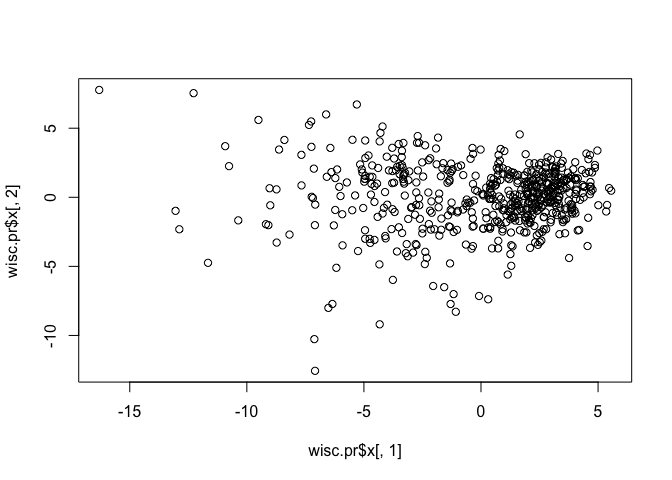
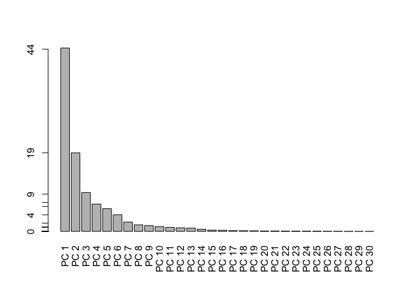
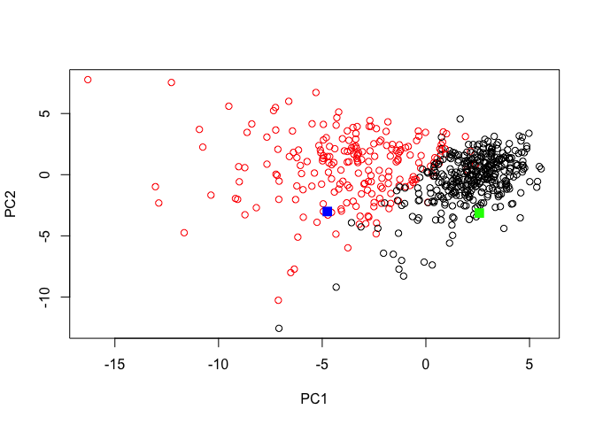

Class 9
================
Katelynn Kazane
2/8/2019

**PCA and Clustering Project**
------------------------------

Get our input data
------------------

``` r
fna.data <- "WisconsinCancer.csv"
wisc.df <- read.csv(fna.data)
```

Always double check that your data is correct.

``` r
head(wisc.df)
```

    ##         id diagnosis radius_mean texture_mean perimeter_mean area_mean
    ## 1   842302         M       17.99        10.38         122.80    1001.0
    ## 2   842517         M       20.57        17.77         132.90    1326.0
    ## 3 84300903         M       19.69        21.25         130.00    1203.0
    ## 4 84348301         M       11.42        20.38          77.58     386.1
    ## 5 84358402         M       20.29        14.34         135.10    1297.0
    ## 6   843786         M       12.45        15.70          82.57     477.1
    ##   smoothness_mean compactness_mean concavity_mean concave.points_mean
    ## 1         0.11840          0.27760         0.3001             0.14710
    ## 2         0.08474          0.07864         0.0869             0.07017
    ## 3         0.10960          0.15990         0.1974             0.12790
    ## 4         0.14250          0.28390         0.2414             0.10520
    ## 5         0.10030          0.13280         0.1980             0.10430
    ## 6         0.12780          0.17000         0.1578             0.08089
    ##   symmetry_mean fractal_dimension_mean radius_se texture_se perimeter_se
    ## 1        0.2419                0.07871    1.0950     0.9053        8.589
    ## 2        0.1812                0.05667    0.5435     0.7339        3.398
    ## 3        0.2069                0.05999    0.7456     0.7869        4.585
    ## 4        0.2597                0.09744    0.4956     1.1560        3.445
    ## 5        0.1809                0.05883    0.7572     0.7813        5.438
    ## 6        0.2087                0.07613    0.3345     0.8902        2.217
    ##   area_se smoothness_se compactness_se concavity_se concave.points_se
    ## 1  153.40      0.006399        0.04904      0.05373           0.01587
    ## 2   74.08      0.005225        0.01308      0.01860           0.01340
    ## 3   94.03      0.006150        0.04006      0.03832           0.02058
    ## 4   27.23      0.009110        0.07458      0.05661           0.01867
    ## 5   94.44      0.011490        0.02461      0.05688           0.01885
    ## 6   27.19      0.007510        0.03345      0.03672           0.01137
    ##   symmetry_se fractal_dimension_se radius_worst texture_worst
    ## 1     0.03003             0.006193        25.38         17.33
    ## 2     0.01389             0.003532        24.99         23.41
    ## 3     0.02250             0.004571        23.57         25.53
    ## 4     0.05963             0.009208        14.91         26.50
    ## 5     0.01756             0.005115        22.54         16.67
    ## 6     0.02165             0.005082        15.47         23.75
    ##   perimeter_worst area_worst smoothness_worst compactness_worst
    ## 1          184.60     2019.0           0.1622            0.6656
    ## 2          158.80     1956.0           0.1238            0.1866
    ## 3          152.50     1709.0           0.1444            0.4245
    ## 4           98.87      567.7           0.2098            0.8663
    ## 5          152.20     1575.0           0.1374            0.2050
    ## 6          103.40      741.6           0.1791            0.5249
    ##   concavity_worst concave.points_worst symmetry_worst
    ## 1          0.7119               0.2654         0.4601
    ## 2          0.2416               0.1860         0.2750
    ## 3          0.4504               0.2430         0.3613
    ## 4          0.6869               0.2575         0.6638
    ## 5          0.4000               0.1625         0.2364
    ## 6          0.5355               0.1741         0.3985
    ##   fractal_dimension_worst  X
    ## 1                 0.11890 NA
    ## 2                 0.08902 NA
    ## 3                 0.08758 NA
    ## 4                 0.17300 NA
    ## 5                 0.07678 NA
    ## 6                 0.12440 NA

The last row has an undefined value, we also want to exclude diagnosis and patient IDs before we analyze all of this information. We'll only be using columns 3 to the next to last column. Now we're going to look at the number of patients and features.

``` r
#number of patients
nrow(wisc.df)
```

    ## [1] 569

``` r
#of columns/categories
ncol(wisc.df)
```

    ## [1] 33

Cleaning up the data. Taking columns 3-32 (for reasons above).

``` r
wisc.data <- wisc.df[,3:32]
head(wisc.data)
```

    ##   radius_mean texture_mean perimeter_mean area_mean smoothness_mean
    ## 1       17.99        10.38         122.80    1001.0         0.11840
    ## 2       20.57        17.77         132.90    1326.0         0.08474
    ## 3       19.69        21.25         130.00    1203.0         0.10960
    ## 4       11.42        20.38          77.58     386.1         0.14250
    ## 5       20.29        14.34         135.10    1297.0         0.10030
    ## 6       12.45        15.70          82.57     477.1         0.12780
    ##   compactness_mean concavity_mean concave.points_mean symmetry_mean
    ## 1          0.27760         0.3001             0.14710        0.2419
    ## 2          0.07864         0.0869             0.07017        0.1812
    ## 3          0.15990         0.1974             0.12790        0.2069
    ## 4          0.28390         0.2414             0.10520        0.2597
    ## 5          0.13280         0.1980             0.10430        0.1809
    ## 6          0.17000         0.1578             0.08089        0.2087
    ##   fractal_dimension_mean radius_se texture_se perimeter_se area_se
    ## 1                0.07871    1.0950     0.9053        8.589  153.40
    ## 2                0.05667    0.5435     0.7339        3.398   74.08
    ## 3                0.05999    0.7456     0.7869        4.585   94.03
    ## 4                0.09744    0.4956     1.1560        3.445   27.23
    ## 5                0.05883    0.7572     0.7813        5.438   94.44
    ## 6                0.07613    0.3345     0.8902        2.217   27.19
    ##   smoothness_se compactness_se concavity_se concave.points_se symmetry_se
    ## 1      0.006399        0.04904      0.05373           0.01587     0.03003
    ## 2      0.005225        0.01308      0.01860           0.01340     0.01389
    ## 3      0.006150        0.04006      0.03832           0.02058     0.02250
    ## 4      0.009110        0.07458      0.05661           0.01867     0.05963
    ## 5      0.011490        0.02461      0.05688           0.01885     0.01756
    ## 6      0.007510        0.03345      0.03672           0.01137     0.02165
    ##   fractal_dimension_se radius_worst texture_worst perimeter_worst
    ## 1             0.006193        25.38         17.33          184.60
    ## 2             0.003532        24.99         23.41          158.80
    ## 3             0.004571        23.57         25.53          152.50
    ## 4             0.009208        14.91         26.50           98.87
    ## 5             0.005115        22.54         16.67          152.20
    ## 6             0.005082        15.47         23.75          103.40
    ##   area_worst smoothness_worst compactness_worst concavity_worst
    ## 1     2019.0           0.1622            0.6656          0.7119
    ## 2     1956.0           0.1238            0.1866          0.2416
    ## 3     1709.0           0.1444            0.4245          0.4504
    ## 4      567.7           0.2098            0.8663          0.6869
    ## 5     1575.0           0.1374            0.2050          0.4000
    ## 6      741.6           0.1791            0.5249          0.5355
    ##   concave.points_worst symmetry_worst fractal_dimension_worst
    ## 1               0.2654         0.4601                 0.11890
    ## 2               0.1860         0.2750                 0.08902
    ## 3               0.2430         0.3613                 0.08758
    ## 4               0.2575         0.6638                 0.17300
    ## 5               0.1625         0.2364                 0.07678
    ## 6               0.1741         0.3985                 0.12440

If we want to get rid of columns in the middle, we can make a vector: c(4, 10, 32)

Now we want to set the row names to the patient IDs. That way we can track the patients without treating the IDs as values to be incorporated.

``` r
rownames(wisc.data) <- wisc.df$id
head(wisc.data)
```

    ##          radius_mean texture_mean perimeter_mean area_mean smoothness_mean
    ## 842302         17.99        10.38         122.80    1001.0         0.11840
    ## 842517         20.57        17.77         132.90    1326.0         0.08474
    ## 84300903       19.69        21.25         130.00    1203.0         0.10960
    ## 84348301       11.42        20.38          77.58     386.1         0.14250
    ## 84358402       20.29        14.34         135.10    1297.0         0.10030
    ## 843786         12.45        15.70          82.57     477.1         0.12780
    ##          compactness_mean concavity_mean concave.points_mean symmetry_mean
    ## 842302            0.27760         0.3001             0.14710        0.2419
    ## 842517            0.07864         0.0869             0.07017        0.1812
    ## 84300903          0.15990         0.1974             0.12790        0.2069
    ## 84348301          0.28390         0.2414             0.10520        0.2597
    ## 84358402          0.13280         0.1980             0.10430        0.1809
    ## 843786            0.17000         0.1578             0.08089        0.2087
    ##          fractal_dimension_mean radius_se texture_se perimeter_se area_se
    ## 842302                  0.07871    1.0950     0.9053        8.589  153.40
    ## 842517                  0.05667    0.5435     0.7339        3.398   74.08
    ## 84300903                0.05999    0.7456     0.7869        4.585   94.03
    ## 84348301                0.09744    0.4956     1.1560        3.445   27.23
    ## 84358402                0.05883    0.7572     0.7813        5.438   94.44
    ## 843786                  0.07613    0.3345     0.8902        2.217   27.19
    ##          smoothness_se compactness_se concavity_se concave.points_se
    ## 842302        0.006399        0.04904      0.05373           0.01587
    ## 842517        0.005225        0.01308      0.01860           0.01340
    ## 84300903      0.006150        0.04006      0.03832           0.02058
    ## 84348301      0.009110        0.07458      0.05661           0.01867
    ## 84358402      0.011490        0.02461      0.05688           0.01885
    ## 843786        0.007510        0.03345      0.03672           0.01137
    ##          symmetry_se fractal_dimension_se radius_worst texture_worst
    ## 842302       0.03003             0.006193        25.38         17.33
    ## 842517       0.01389             0.003532        24.99         23.41
    ## 84300903     0.02250             0.004571        23.57         25.53
    ## 84348301     0.05963             0.009208        14.91         26.50
    ## 84358402     0.01756             0.005115        22.54         16.67
    ## 843786       0.02165             0.005082        15.47         23.75
    ##          perimeter_worst area_worst smoothness_worst compactness_worst
    ## 842302            184.60     2019.0           0.1622            0.6656
    ## 842517            158.80     1956.0           0.1238            0.1866
    ## 84300903          152.50     1709.0           0.1444            0.4245
    ## 84348301           98.87      567.7           0.2098            0.8663
    ## 84358402          152.20     1575.0           0.1374            0.2050
    ## 843786            103.40      741.6           0.1791            0.5249
    ##          concavity_worst concave.points_worst symmetry_worst
    ## 842302            0.7119               0.2654         0.4601
    ## 842517            0.2416               0.1860         0.2750
    ## 84300903          0.4504               0.2430         0.3613
    ## 84348301          0.6869               0.2575         0.6638
    ## 84358402          0.4000               0.1625         0.2364
    ## 843786            0.5355               0.1741         0.3985
    ##          fractal_dimension_worst
    ## 842302                   0.11890
    ## 842517                   0.08902
    ## 84300903                 0.08758
    ## 84348301                 0.17300
    ## 84358402                 0.07678
    ## 843786                   0.12440

How many malignant v begnin tumors are there?

``` r
table(wisc.df$diagnosis)
```

    ## 
    ##   B   M 
    ## 357 212

We want to find out how many of the columns are mean values. Therefore we have to search for the columns containing "mean". (Remember we're using "wisc.data"")

``` r
#colnames(wisc.data)
length( grep("_mean",colnames(wisc.data)) )
```

    ## [1] 10

We have how many there are, but to find out the names, we need to reference the values again.

``` r
inds <- grep("_mean",colnames(wisc.data))
colnames(wisc.data)[inds]
```

    ##  [1] "radius_mean"            "texture_mean"          
    ##  [3] "perimeter_mean"         "area_mean"             
    ##  [5] "smoothness_mean"        "compactness_mean"      
    ##  [7] "concavity_mean"         "concave.points_mean"   
    ##  [9] "symmetry_mean"          "fractal_dimension_mean"

**Principal Component Analysis**

Checking the column means and standard deviations to examine if we need to scale things.

``` r
# we can use this <- colMeans(wisc.data). But the following is better:
round( apply(wisc.data, 2, mean), 2)
```

    ##             radius_mean            texture_mean          perimeter_mean 
    ##                   14.13                   19.29                   91.97 
    ##               area_mean         smoothness_mean        compactness_mean 
    ##                  654.89                    0.10                    0.10 
    ##          concavity_mean     concave.points_mean           symmetry_mean 
    ##                    0.09                    0.05                    0.18 
    ##  fractal_dimension_mean               radius_se              texture_se 
    ##                    0.06                    0.41                    1.22 
    ##            perimeter_se                 area_se           smoothness_se 
    ##                    2.87                   40.34                    0.01 
    ##          compactness_se            concavity_se       concave.points_se 
    ##                    0.03                    0.03                    0.01 
    ##             symmetry_se    fractal_dimension_se            radius_worst 
    ##                    0.02                    0.00                   16.27 
    ##           texture_worst         perimeter_worst              area_worst 
    ##                   25.68                  107.26                  880.58 
    ##        smoothness_worst       compactness_worst         concavity_worst 
    ##                    0.13                    0.25                    0.27 
    ##    concave.points_worst          symmetry_worst fractal_dimension_worst 
    ##                    0.11                    0.29                    0.08

Note that apply(wisc.data, **2**) refers to columns. 1 would refer to rows.

``` r
round( apply(wisc.data, 2, sd), 2)
```

    ##             radius_mean            texture_mean          perimeter_mean 
    ##                    3.52                    4.30                   24.30 
    ##               area_mean         smoothness_mean        compactness_mean 
    ##                  351.91                    0.01                    0.05 
    ##          concavity_mean     concave.points_mean           symmetry_mean 
    ##                    0.08                    0.04                    0.03 
    ##  fractal_dimension_mean               radius_se              texture_se 
    ##                    0.01                    0.28                    0.55 
    ##            perimeter_se                 area_se           smoothness_se 
    ##                    2.02                   45.49                    0.00 
    ##          compactness_se            concavity_se       concave.points_se 
    ##                    0.02                    0.03                    0.01 
    ##             symmetry_se    fractal_dimension_se            radius_worst 
    ##                    0.01                    0.00                    4.83 
    ##           texture_worst         perimeter_worst              area_worst 
    ##                    6.15                   33.60                  569.36 
    ##        smoothness_worst       compactness_worst         concavity_worst 
    ##                    0.02                    0.16                    0.21 
    ##    concave.points_worst          symmetry_worst fractal_dimension_worst 
    ##                    0.07                    0.06                    0.02

Now PCA time! We need scaling.

Principal Components Analysis (PCA)
-----------------------------------

``` r
wisc.pr <- prcomp(wisc.data, scale = TRUE)
summary(wisc.pr)
```

    ## Importance of components:
    ##                           PC1    PC2     PC3     PC4     PC5     PC6
    ## Standard deviation     3.6444 2.3857 1.67867 1.40735 1.28403 1.09880
    ## Proportion of Variance 0.4427 0.1897 0.09393 0.06602 0.05496 0.04025
    ## Cumulative Proportion  0.4427 0.6324 0.72636 0.79239 0.84734 0.88759
    ##                            PC7     PC8    PC9    PC10   PC11    PC12
    ## Standard deviation     0.82172 0.69037 0.6457 0.59219 0.5421 0.51104
    ## Proportion of Variance 0.02251 0.01589 0.0139 0.01169 0.0098 0.00871
    ## Cumulative Proportion  0.91010 0.92598 0.9399 0.95157 0.9614 0.97007
    ##                           PC13    PC14    PC15    PC16    PC17    PC18
    ## Standard deviation     0.49128 0.39624 0.30681 0.28260 0.24372 0.22939
    ## Proportion of Variance 0.00805 0.00523 0.00314 0.00266 0.00198 0.00175
    ## Cumulative Proportion  0.97812 0.98335 0.98649 0.98915 0.99113 0.99288
    ##                           PC19    PC20   PC21    PC22    PC23   PC24
    ## Standard deviation     0.22244 0.17652 0.1731 0.16565 0.15602 0.1344
    ## Proportion of Variance 0.00165 0.00104 0.0010 0.00091 0.00081 0.0006
    ## Cumulative Proportion  0.99453 0.99557 0.9966 0.99749 0.99830 0.9989
    ##                           PC25    PC26    PC27    PC28    PC29    PC30
    ## Standard deviation     0.12442 0.09043 0.08307 0.03987 0.02736 0.01153
    ## Proportion of Variance 0.00052 0.00027 0.00023 0.00005 0.00002 0.00000
    ## Cumulative Proportion  0.99942 0.99969 0.99992 0.99997 1.00000 1.00000

``` r
biplot(wisc.pr)
```



This plot is awful. We are going to fix it.

Here's how we make our own/make it nicer:

``` r
plot( wisc.pr$x[,1], wisc.pr$x[,2])
```


We have a graph- we want to add some details and expand on it (using the B vs M diagnosis). Ideally we'll want to color it by diagnosis. Because pretty is useful. (And pattern recognition is cool).

``` r
wisc.df$diagnosis
```

    ##   [1] M M M M M M M M M M M M M M M M M M M B B B M M M M M M M M M M M M M
    ##  [36] M M B M M M M M M M M B M B B B B B M M B M M B B B B M B M M B B B B
    ##  [71] M B M M B M B M M B B B M M B M M M B B B M B B M M B B B M M B B B B
    ## [106] M B B M B B B B B B B B M M M B M M B B B M M B M B M M B M M B B M B
    ## [141] B M B B B B M B B B B B B B B B M B B B B M M B M B B M M B B M M B B
    ## [176] B B M B B M M M B M B M B B B M B B M M B M M M M B M M M B M B M B B
    ## [211] M B M M M M B B M M B B B M B B B B B M M B B M B B M M B M B B B B M
    ## [246] B B B B B M B M M M M M M M M M M M M M M B B B B B B M B M B B M B B
    ## [281] M B M M B B B B B B B B B B B B B M B B M B M B B B B B B B B B B B B
    ## [316] B B M B B B M B M B B B B M M M B B B B M B M B M B B B M B B B B B B
    ## [351] B M M M B B B B B B B B B B B M M B M M M B M M B B B B B M B B B B B
    ## [386] M B B B M B B M M B B B B B B M B B B B B B B M B B B B B M B B M B B
    ## [421] B B B B B B B B B B M B M M B M B B B B B M B B M B M B B M B M B B B
    ## [456] B B B B B M M B B B B B B M B B B B B B B B B B M B B B B B B B M B M
    ## [491] B B M B B B B B M M B M B M B B B B B M B B M B M B M M B B B M B B B
    ## [526] B B B B B B B B M B M M B B B B B B B B B B B B B B B B B B B B B B B
    ## [561] B B M M M M M M B
    ## Levels: B M

``` r
#wisc.df$diagnosis is the code we use to call all this data.
plot( wisc.pr$x[,1], wisc.pr$x[,2], col= wisc.df$diagnosis)
```


Time for us to really dig in to the data.

Looking at the variance for each component in the analysis. **We'll be making a scree plot for our PCA results**

``` r
variance <- wisc.pr$sdev^2
#finding the TOTAL variance
pve <- round(variance/sum(variance) * 100, 2)
```

``` r
plot(pve, type = "o")
```



Or we can also make a bar plot. This one has a very strange axis. It is called "data driven".

``` r
# Alternative scree plot of the same data, note data driven y-axis
barplot(pve, axes = FALSE, names.arg = paste("PC", 1:length(pve)), las = 2 )
#targets side two, and uses pve to drive the values.
axis(2, round(pve))
```


Clustering in Principal Component Space
---------------------------------------

We want to make a distance matrix and then use this to make a histogram (e.g. getting a distance matrix from the PCA results- wisc.pr$x).

``` r
d <- dist(wisc.pr$x[,1:2])
hc <- hclust(d, method = "ward.D2")
plot(hc)
```


How do we figure out cluster membership? cutree! Will clip the branches.

``` r
grp3 <- cutree(hc, k = 3)
#This returns a large vector- shows us which ID is in which clusters. So we make a table to show us how many individuals are in each group. 
table(grp3)
```

    ## grp3
    ##   1   2   3 
    ## 112  83 374

Now we'll plot our PCA colored by the clusters we just made.

``` r
plot(wisc.pr$x[,1], wisc.pr$x[,2], xlab = "PC1", ylab = "PC2", col = grp3)
```


We have our three groups. It'll be interesting/more informative to show the contencts of each group. This is known as **Cross Tabulation**

``` r
#table(grp3, ) .... first we need to make diagnosis vector. 
#diagnosis 

diagnosis <- wisc.df$diagnosis == "M"
table(grp3, diagnosis)
```

    ##     diagnosis
    ## grp3 FALSE TRUE
    ##    1     0  112
    ##    2    18   65
    ##    3   339   35

^<sup>^</sup> This is a cross tabulation: We specified that M = TRUE, and r counts TRUE = 1, so the values are counting the number of patients with malignancies in each group. Since TRUE/FALSE can be added as values, we can get this final count.

Predictions
-----------

Will take information from our PCA and use it to predict diagnosis.

``` r
new <- read.csv("new_samples.csv")
npc <- predict(wisc.pr, newdata=new)
npc
```

    ##            PC1       PC2        PC3        PC4       PC5        PC6
    ## [1,]  2.576616 -3.135913  1.3990492 -0.7631950  2.781648 -0.8150185
    ## [2,] -4.754928 -3.009033 -0.1660946 -0.6052952 -1.140698 -1.2189945
    ##             PC7        PC8       PC9       PC10      PC11      PC12
    ## [1,] -0.3959098 -0.2307350 0.1029569 -0.9272861 0.3411457  0.375921
    ## [2,]  0.8193031 -0.3307423 0.5281896 -0.4855301 0.7173233 -1.185917
    ##           PC13     PC14      PC15       PC16        PC17        PC18
    ## [1,] 0.1610764 1.187882 0.3216974 -0.1743616 -0.07875393 -0.11207028
    ## [2,] 0.5893856 0.303029 0.1299153  0.1448061 -0.40509706  0.06565549
    ##             PC19       PC20       PC21       PC22       PC23       PC24
    ## [1,] -0.08802955 -0.2495216  0.1228233 0.09358453 0.08347651  0.1223396
    ## [2,]  0.25591230 -0.4289500 -0.1224776 0.01732146 0.06316631 -0.2338618
    ##             PC25         PC26         PC27        PC28         PC29
    ## [1,]  0.02124121  0.078884581  0.220199544 -0.02946023 -0.015620933
    ## [2,] -0.20755948 -0.009833238 -0.001134152  0.09638361  0.002795349
    ##              PC30
    ## [1,]  0.005269029
    ## [2,] -0.019015820

``` r
plot(wisc.pr$x[,1:2], col = wisc.df$diagnosis)
points(npc[,1], npc[,2], col=c("green","blue"), pch = 15, cex = 1.5)
```



Now we have a framework for how to analyze this data. We can look at past trends, and then put new data into the existing trends. And this is just the start.
