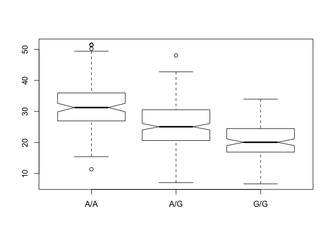

Class 13: Genome Informatics 1
================

Genome Informatics- Using Information from an Online Database
-------------------------------------------------------------

We gathered this information from the *add website* Ensembl page. The idea is to figure out a percentage of our population that has After we put the file into our directory, we need to read it in.

``` r
mxl <- read.csv("373531-SampleGenotypes-Homo_sapiens_Variation_Sample_rs8067378.csv")
head(mxl)
```

    ##   Sample..Male.Female.Unknown. Genotype..forward.strand. Population.s.
    ## 1                  NA19648 (F)                       A|A ALL, AMR, MXL
    ## 2                  NA19649 (M)                       G|G ALL, AMR, MXL
    ## 3                  NA19651 (F)                       A|A ALL, AMR, MXL
    ## 4                  NA19652 (M)                       G|G ALL, AMR, MXL
    ## 5                  NA19654 (F)                       G|G ALL, AMR, MXL
    ## 6                  NA19655 (M)                       A|G ALL, AMR, MXL
    ##   Father Mother
    ## 1      -      -
    ## 2      -      -
    ## 3      -      -
    ## 4      -      -
    ## 5      -      -
    ## 6      -      -

Now we look at the numbers of each genotype.

``` r
table(mxl$Genotype..forward.strand.)
```

    ## 
    ## A|A A|G G|A G|G 
    ##  22  21  12   9

Calculating the percentage of G|G in the total popuation.

``` r
table(mxl$Genotype..forward.strand.) / nrow(mxl) * 100
```

    ## 
    ##     A|A     A|G     G|A     G|G 
    ## 34.3750 32.8125 18.7500 14.0625

Initial RNA Seq Analysis
------------------------

We'll download the fasta files from the class website. We'll be using unix commands to look at this data because the files are so large. head ~Downloads/HG00109\_1.fastq head allows us to look at our data.

This gives us a unique identifier, our code, and then the ASCII base qualities.

Quality Scores
--------------

``` r
#install seqinr and gtools
library(seqinr)
library(gtools)
chars <- s2c("DDDDCDEDCDDDDBBDDDCC@")
chars
```

    ##  [1] "D" "D" "D" "D" "C" "D" "E" "D" "C" "D" "D" "D" "D" "B" "B" "D" "D"
    ## [18] "D" "C" "C" "@"

``` r
phred <- asc( chars ) - 33
phred
```

    ##  D  D  D  D  C  D  E  D  C  D  D  D  D  B  B  D  D  D  C  C  @ 
    ## 35 35 35 35 34 35 36 35 34 35 35 35 35 33 33 35 35 35 34 34 31

Now we'll be trying out Galaxy. (Using a previously set up IP address).

Population Scale Analysis
-------------------------

``` r
expr <- read.table("rs8067378_ENSG00000172057.6.txt")
head(expr)
```

    ##    sample geno      exp
    ## 1 HG00367  A/G 28.96038
    ## 2 NA20768  A/G 20.24449
    ## 3 HG00361  A/A 31.32628
    ## 4 HG00135  A/A 34.11169
    ## 5 NA18870  G/G 18.25141
    ## 6 NA11993  A/A 32.89721

``` r
table(expr$geno)
```

    ## 
    ## A/A A/G G/G 
    ## 108 233 121

``` r
inds.gg <- expr$geno == "G/G"
summary(expr[inds.gg,"exp"])
```

    ##    Min. 1st Qu.  Median    Mean 3rd Qu.    Max. 
    ##   6.675  16.903  20.074  20.594  24.457  33.956

``` r
inds.ag <- expr$geno == "A/G"
summary(expr[inds.ag, "exp"])
```

    ##    Min. 1st Qu.  Median    Mean 3rd Qu.    Max. 
    ##   7.075  20.626  25.065  25.397  30.552  48.034

``` r
inds.aa <- expr$geno == "A/A"
summary(expr[inds.aa, "exp"])
```

    ##    Min. 1st Qu.  Median    Mean 3rd Qu.    Max. 
    ##   11.40   27.02   31.25   31.82   35.92   51.52

We have all of this information, now we'd like a much nicer way to display it. Let's use a boxplot!

``` r
boxplot(exp ~ geno, data=expr)
```


Now it's time to change the graphics.

``` r
boxplot(exp ~ geno, data=expr, notch = TRUE)
```



There are other graphs we can use. (Maybe try ggplot).

Experimenting with "GGPlot"" Package
------------------------------------
